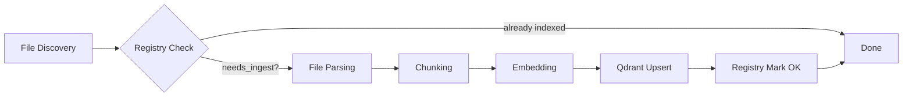
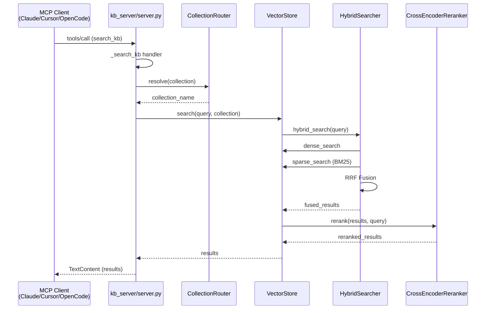

# KB-RAG-MCP Architecture

## Overview

kb-rag-mcp has two independent subsystems: **Ingest Pipeline** and **Query Server**,
connected by a shared **Qdrant** vector store.

---

## Ingest Workflow

1. **File Discovery** — CLI (`kb-ingest`), file watcher, or job scheduler finds new/changed files
2. **Registry Check** — SQLite registry (`data/registry.db`) checks SHA256 hash; skips unchanged files
3. **File Parsing** — Format-specific extractors: PyMuPDF (PDF), python-docx (DOCX), openpyxl (XLSX),
   python-pptx (PPTX), docx2txt (legacy .doc), xlrd (legacy .xls), odfpy (ODF)
4. **Chunking** — `langchain-text-splitters` splits documents into overlapping chunks
5. **Embedding** — `EmbedClient` generates dense vectors via LM Studio, Ollama, or OpenAI-compatible API
6. **Qdrant Upsert** — Chunks + metadata upserted to Qdrant collection with dense + sparse (BM25) vectors
7. **Registry Mark OK** — File marked as successfully indexed

---

## Query Architecture

1. **MCP Client** sends `tools/call` with `search_kb` and query parameters
2. **server.py** handler validates args and calls CollectionRouter to resolve collection name
3. **VectorStore.search** performs hybrid search:
   - Dense vector similarity (cosine/dot)
   - Sparse BM25 via fastembed
   - RRF (Reciprocal Rank Fusion) merges results
4. **CrossEncoderReranker** optionally reranks top results for precision
5. Results returned as `TextContent` via MCP protocol

---

## Component Map

| Layer | Location | Responsibility |
|-------|----------|----------------|
| **MCP Server** | `kb_server/server.py` | Tool registration, dispatch, SSE/stdio transport |
| **Vector Store** | `kb_server/vector_store.py` | Qdrant CRUD, search, upsert, stats |
| **Embed Client** | `kb_server/embed_client.py` | Multi-backend embedding (LM Studio, Ollama, OpenAI) |
| **Hybrid Search** | `kb_server/retrieval/hybrid_search.py` | Dense+sparse RRF fusion |
| **Reranker** | `kb_server/retrieval/reranker.py` | Cross-encoder reranking |
| **Collections** | `kb_server/collections/` | CollectionManager CRUD, CollectionRouter |
| **Cache** | `kb_server/cache/` | In-memory LRU + optional Redis |
| **Ingest Pipeline** | `ingest/` | Extraction, chunking, embedding, indexing |
| **Observability** | `observability/`, `kb_server/telemetry/`, `kb_server/analytics/` | Metrics, logging, query analysis |
| **Health** | `kb_server/health_server.py` | HTTP health check endpoint |

---

## Deployment Options

- **Bare metal** — systemd units (`scripts/kb-mcp.service`)
- **Docker Compose** — `docker-compose.yml` with Qdrant container
- **Kubernetes/Helm** — `deployment/helm/kb-rag-mcp/` chart
- **Remote server (acemagic/LXC)** — See [OPERATIONS.md](OPERATIONS.md) for remote deployment guide

See also: [REFERENCE.md](REFERENCE.md), [OPERATIONS.md](OPERATIONS.md)
