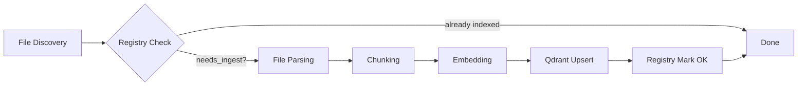
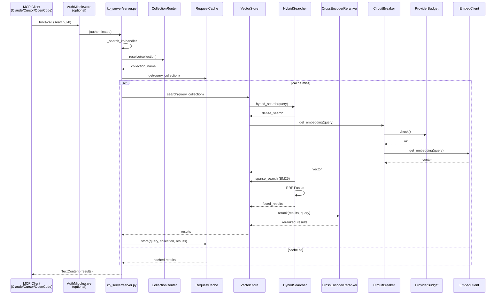

# KB-RAG-MCP Architecture

## Overview

kb-rag-mcp has multiple subsystems: **Ingest Pipeline**, **Query Server**,
**Enterprise Connectors**, **Knowledge Graph**, **MCP Prompts**, and
**Resilience & Security** (auth, rate limiter, circuit breaker, provider budget, request cache),
connected by a shared **Qdrant** vector store.

---

## Ingest Workflow

1. **File Discovery** — CLI (`kb-ingest`), file watcher, or job scheduler finds new/changed files
2. **Registry Check** — SQLite registry (`data/registry.db`) checks SHA256 hash; skips unchanged files
3. **File Parsing** — Format-specific extractors: PyMuPDF (PDF), python-docx (DOCX), openpyxl (XLSX),
   python-pptx (PPTX), docx2txt (legacy .doc), xlrd (legacy .xls), odfpy (ODF)
4. **Chunking** — `langchain-text-splitters` splits documents into overlapping chunks
5. **Embedding** — `EmbedClient` generates dense vectors via LM Studio, Ollama, or OpenAI-compatible API
6. **Qdrant Upsert** — Chunks + metadata upserted to Qdrant collection with dense + sparse (BM25) vectors
7. **Registry Mark OK** — File marked as successfully indexed

---

## Query Architecture

1. **MCP Client** sends `tools/call` with `search_kb` and query parameters
2. **AuthMiddleware** optionally validates Bearer token (SSE transport only)
3. **server.py** handler validates args and calls CollectionRouter to resolve collection name
4. **RequestCache** checks for cached results for the same query+collection; cache hit returns immediately
5. **VectorStore.search** performs hybrid search:
   - Dense vector similarity (cosine/dot) — query embedded via **EmbedClient**, wrapped by **CircuitBreaker** (CLOSED/OPEN/HALF_OPEN per provider) and **ProviderBudget** (sliding window budget check)
   - Sparse BM25 via fastembed
   - RRF (Reciprocal Rank Fusion) merges results
6. **CrossEncoderReranker** optionally reranks top results for precision
7. Results cached in **RequestCache** and returned as `TextContent` via MCP protocol

### Multi-KB Search

Multi-collection search flows through `kb_ids` → `resolve_multi()` → `multi_search()` → `merge_multi_collection_results()`, enabling cross-product queries across distinct Qdrant collections.

---

## Component Map

| Layer | Location | Responsibility |
|-------|----------|----------------|
| **MCP Server** | `kb_server/server.py` | Tool registration, dispatch, SSE/stdio transport |
| **Vector Store** | `kb_server/vector_store.py` | Qdrant CRUD, search, upsert, stats |
| **Embed Client** | `kb_server/embed_client.py` | Multi-backend embedding (LM Studio, Ollama, OpenAI) |
| **Hybrid Search** | `kb_server/retrieval/hybrid_search.py` | Dense+sparse RRF fusion |
| **Reranker** | `kb_server/retrieval/reranker.py` | Cross-encoder reranking |
| **Collections** | `kb_server/collections/` | CollectionManager CRUD, CollectionRouter |
| **Cache** | `kb_server/cache/` | In-memory LRU + optional Redis |
| **Ingest Pipeline** | `ingest/` | Extraction, chunking, embedding, indexing |
| **Observability** | `observability/`, `kb_server/telemetry/`, `kb_server/analytics/` | Metrics, logging, query analysis |
| **Enterprise Connectors** | `ingest/connectors/` | Factory + Confluence/JIRA/Git sources |
| **Knowledge Graph** | `ingest/graph_builder.py` | Document graph metadata derivation |
| **MCP Prompts** | `kb_server/prompts.py` | extract_answer + summarize_documents |
| **Auth** | `kb_server/auth/` | Optional Bearer token auth, API key management, erasure |
| **Rate Limiter** | `kb_server/rate_limiter.py` | Per-subject token bucket |
| **Circuit Breaker** | `kb_server/circuit_breaker.py` | Provider resilience state machine |
| **Provider Budget** | `kb_server/provider_budget.py` | Sliding window budget tracking |
| **Retrieval Cache** | `kb_server/cache/request_cache.py` | Request-level search caching |
| **Health** | `kb_server/health_server.py` | HTTP health check endpoint |
| **Admin UI** | `kb_server/ui/` | FastAPI + HTMX admin SPA (browse, search, config, auth) |
| **Config API** | `kb_server/config/` | REST CRUD for server configuration |
| **Filter Terms** | `kb_server/filter_terms_cache.py` | Dynamic filter suggestions for MCP tools |

---

## Deployment Options

- **Bare metal** — systemd units (`scripts/kb-mcp.service`)
- **Docker Compose** — `docker-compose.yml` with Qdrant container
- **Kubernetes/Helm** — `deployment/helm/kb-rag-mcp/` chart
- **Remote server (acemagic/LXC)** — See [OPERATIONS.md](OPERATIONS.md) for remote deployment guide

See also: [REFERENCE.md](REFERENCE.md), [OPERATIONS.md](OPERATIONS.md)

---

*Last updated: 2026-06-29*
